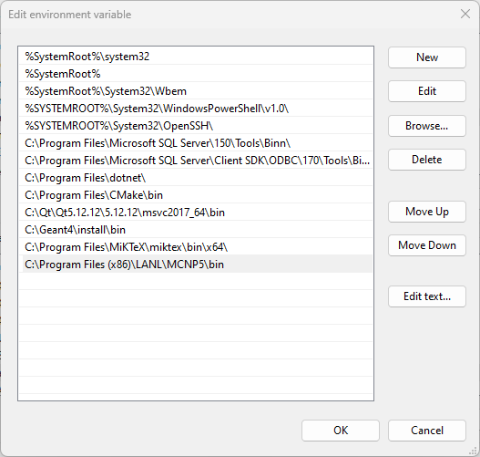
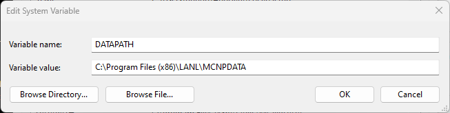
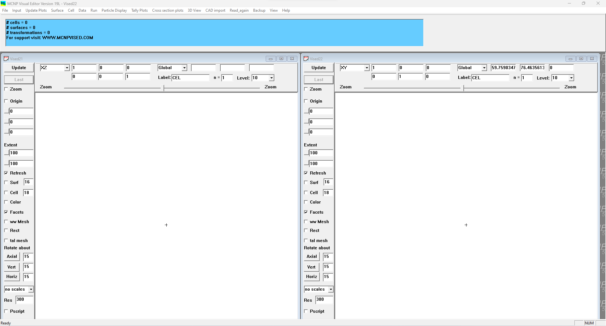
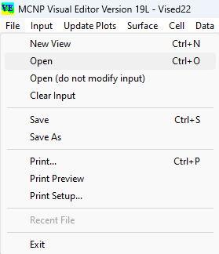
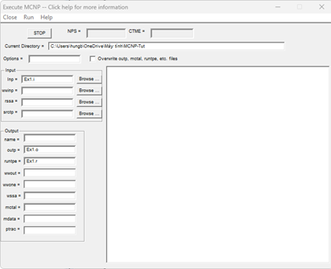

# BÀI 1. LÀM QUEN VỚI MCNP

## 1. Bài toán
**Xét ví dụ sau:**
Có một quả cầu oxy đường kính 0,5 cm (Cell 1) và một quả cầu bằng sắt đường kính 0,5 cm (Cell 2) được đặt trong một khối hộp làm bằng carbon (Cell 3) với kích thước các cạnh là 10 cm. Cell 4 được mô tả như một “không gian bên ngoài hình hộp”. Một nguồn điểm đẳng hướng phát neutron 14 MeV được đặt tại tâm của khối cầu oxy nằm trong khối hộp carbon. Hãy tính tổng thông lượng và thông lượng theo năng lượng (bước tăng 1 MeV) từ 1 tới 14 MeV trong 2 trường hợp:
    - Trên bền mặt khối cầu sắt
    - Trung bình trong thể tích khối cầu sắt 


*Hình 1.1. Minh họa bài toán ví dụ*

**Hướng dẫn:**
**Bước 1:** Tạo một tệp tin dạng văn bản text mới có tên "***VD11***", lưu ý tệp tin này không có phần mở rộng.

> **Chú ý 1:**  
> Tệp tin VD11 được tạo ra ở trên được gọi là tệp đầu vào (input file) của chương trình MCNP, nhiệm vụ của người dùng khi mô phỏng bằng MCNP là phải tạo được một tệp đầu vào chứa các dòng lệnh mô tả chi tiết hệ vật lý cần mô hình hóa.

**Bước 2:** Sao chép đoạn mã sau và dán vào tệp tin mới tạo và lưu lại. Lưu ý, có các dòng trống trong đoạn mã ví dụ này cần phải giữ nguyên gốc khi sao chép.

```c++
Sample Problem Input Deck
c Cell cards for sample problem
1 1 -0.0014 -7
2 2 -7.86 -8
3 3 -1.60 1 -2 -3 4 -5 6 7 8
4 0 -1:2:3:-4:5:-6
c End of cell cards for sample problem

c Beginning of Surfaces for cube
1 pz -5
2 pz 5
3 py 5
4 py -5
5 px 5
6 px -5
c End of cube surface
7 s 0 -4 -2.5 0.5 $ oxygen shpere
8 s 0 4 4.5 0.5 $ iron shpere

imp:n 1 1 1 0
sdef pos=0 -4 -2.5
f2:n 8 $ flux across surface 8
f4:n 2 $ track length in cell 2
e0 1 12i 14
m1 8016 1 $ oxygen 16
m2 26000 1 $ natural iron
m3 6000 1 $ carbon
nps 100000

```

> **Chú ý 2:**  
> Trong đoạn mã trên cần lưu ý có 2 dòng trống được sử dụng để ngăn cách đoạn mã thành 3 đoạn, người ta đặt tên ba khối lần lượt là khối surface (surface block) – khối cell (cell block) – khối data (data block) và một dòng trống cuối cùng được sử dụng để thông báo sự kết thúc của tệp input.
> 
>  Dòng đầu tiên của đoạn mã được gọi là dòng tiêu đề, được sử dụng để ghi tiêu đề giải thích cho tệp input (tiêu đề là tùy chọn và người sử dụng có thể không cần khai báo).
> 
>   Các dòng bắt đầu bằng kí tự “c” được gọi là dòng ghi chú mã MCNP sẽ bỏ qua tất cả các ký tự phía sau nó (chỉ trong một dòng), do đó kí tự “c”  bắt buộc phải đặt ở đầu dòng. Các kí tự “$” chỉ được đặt ở vị trí kí tự thứ 6 – 80 trong một dòng, chương trình MCNP sẽ bỏ qua các kí tự sau nó. Sự khác biệt giữa hai cách ghi chú này là việc người sử dụng muốn ghi chủ bằng cả một dòng hay từ vị trí bất kì trên dòng.

**Bước 3:** Thử chạy chương trình sử dụng VisEd.
- Để chạy được MCNP bằng VisEd chúng ta cần lưu ý đến các biến môi trường có được thêm vào hệ thống hay chưa đó là đường dẫn tới thư mục ".../bin" và thư mục "MCNP_DATA".
Kiểm tra biến môi trường bằng cách kích chuột phải vào biểu tượng ThisPC -> Properties -> Advance system Settings -> Environment Variables.



*Hình 1.2. Biến môi trường được cài đặt thành công*
- Mở chương trình VisEd bằng cách kích đúp chuột trái vào biểu tượng. Lưu ý, VisEd là một chương trình độc lập so với MCNP, nó không cần cài đặt và có thể chạy trực tiếp bằng thao tác kích chuột.

*Hình 1.3. Giao diện chương trình VisEd*
- Truy cập menu File -> Open hoặc tổ hợp Ctrl+O để mở tệp đầu vào đã tạo ra


*Hình 1.4. Mở tệp đầu vào trên VisEd*

Kích chọn vào các ô Surf, Cell, Color để xem hình học mô phỏng

*Hình 1.5. Hình học của tệp đầu vào*
- Chạy tệp đầu vào, truy cập vào menu Run, nhập vào các trường như hình sau. Sau đó kích chọn Run để bắt đầu tính toán.

*Hình 1.6. Menu thực hiện tính toán*

## 2. Lý thuyết
### 2.1. Cấu trúc của một tệp đầu vào MCNP
- Cấu trúc cơ bản để soạn một tệp đầu vào MCNP như sau, các cấu trúc khác sẽ  được trình bày trong các bài sau.
```c++
Message Block // Optional
Blank Line Delimiter // Optional
Problem Title Card // Optional
Cell Card Block
...
Blank Line Delimiter
Surface Card Block
...
Blank Line Delimiter
Data Card Block
...
Blank Line Terminator //Optional, but recommended
Anything else // Optional
```
- Một tệp đầu vào bắt buộc phải có ba khối chính bao gồm
    - Cell Block
    - Surface Block
    - Data Block
- Mội Block được cách nhau bằng một dòng trống. Kết thúc Data Block không bắt buộc phải là một dòng trống, tuy nhiên ta nên sử dụng vào chương trình.
- Dòng "Problem Title Card" mô tả tiêu đề của tệp input (điều này là không bắt buộc). Đối với ví dụ ban đầu nó tương đương với "Sample Problem Input Deck".
- Dòng "Message Block" là dòng khai báo câu lệnh sẽ được tìm hiểu trong các bài sau. Nếu dòng này được sử dụng, ta cần phải có một dòng trống ngăn cách phía trước với Cell Block.

### 2.2. Những lưu ý khi soạn tệp input
- Sử dụng Notepad hoặc Notepad++ để soạn thảo.
- Tên tệp không quá 8 kí tự, và không được chứa kí tự có dấu tiếng việt.
- Không được sử dụng phím Tab khi soạn thảo, chỉ được phép dùng dấu cách để tạo khoảng trắng.
- Số kí tự tối đa của một dòng là 80.
- Kí tự c chỉ được phép ở đầu dòng (kí tự 1 - 5).
- Kí tự $ xuất hiện ở giữa dòng từ kí tự 6 - 80.
- Trong MCNP các đại lượng được coi là có đơn vị mặc định như sau: Năng lượng (MeV), khối lượng (g), độ dài (cm), mật độ (g/cm3), ...

### 2.3. Chạy tệp đầu vào bằng dòng lệnh CMD
- Sử dụng dòng lệnh CMD là một cách thuận tiện để chạy tệp input của chương trình MCNP. Điều cần thiết là hai biến môi trường phải được cài đặt trước đó. Để kiểm tra MCNP5 có hoạt động hay không, mở Command Prompt và nhập mcnp5. Nếu kết quả thông báo như hình sau, điều đó có nghĩa MCNP5 có thể thực hiện chạy bằng dòng lệnh CMD.


*Hình 1.7. Kiểm tra MCNP5 đã được cài đặt bằng cửa sổ dòng lệnh*

- Cú pháp chung để chạy như sau:
```c++
mcnp5 KEYWORD=value ... execution_option(s) other_options
```
**Trong đó:**
    KEYWORD=value: sử dụng để đặt tên cho các tệp vào và ra
    execution_option(s): là các lệnh thao tác với tệp
    other_options: các thao tác khác khi mô phỏng
> **Chú ý 3:** 
> Trong bài này chúng ta sẽ không tìm hiểu hết các lệnh mà chỉ quan tâm tới một số lệnh rất cơ bản.

- Trong trường hợp đơn giản nhất, kết quả đầu ra của MCNP sẽ bao gồm 2 tệp đó là OUTPUT và RUNTPE. Tệp OUTPUT chứa thông tin và các kết quả đầu ra, người sử dụng có thể hiển thị nội dung của nó bằng các trình soạn thảo text như Notepad. Trong khi RUNTPE là tệp chứa thông tin của quá trình mô phỏng dưới dạng mã nhị phân do đó không thể đọc chúng bằng các cách thông thường.
- Ví dụ, nếu có tệp đầu vào với tên **viDu**, để chạy tệp này ta sử dụng như sau:
```c++
mcnp5 inp=viDu out=viDu.o runtpe=viDu.r
```
> **Chú ý 4:**
> - Ở dòng lệnh trên tên của tệp đầu ra là viDu.o và tên của tệp RUN là viDu.r, phần mở rộng của chúng (".o" và ".r") được thêm vào để giúp phân biệt từng loại tệp. Người sử dụng có thể không cần phần đuôi mở rộng tuy nhiên tên của chúng khi đó phải đặt khác nhau.
> - Các kí tự inp, out và runtpe được gọi là các KEYWORD

- Một cách đơn giản hơn, có thể sử dụng cách viết tắt KEYWORD như sau: 
```c++
mcnp5 i=viDu.i o=viDu.o r=viDu.r
```

- Hoặc ngắn gọn nhất:
```c++
mcnp5 n=viDu.i
```

> **Chú ý 5:**
> Khi sử dụng KEYWORD n, lúc này các tệp OUTPUT và RUNTPE sẽ tự động tạo ra tên cho chúng.

- Có thể sử dụng các execution_option(s) để thao tác với tệp INPUT:
    - i = gọi mô-đun IMCN để xử lý tệp
    - p = gọi mô-đun PLOT để vẽ hình
    - x = gọi mô-đun XACT để xử lý dữ liệu tiết diện phản ứng
    - r = gọi mô-đun MCRUN để vận chuyển hạt
    - z = gọi mô-đun MCPLOT để vẽ kết quả tally/vẽ dữ liệu tiết diện

- Câu lệnh đầy đủ nhất để chạy tệp **viDu** là:
```c++
mcnp5 inp=viDu out=viDu.o runtpe=viDu.r ixr
```

> **Chú ý 6:**
> Nếu không khai báo execution_option(s), thì mặc định chương trình sẽ hiểu là execution_option(s) = ixr.

- Nếu chỉ muốn kiểm tra tệp INPUT có đúng cú pháp hay không, có thể sử dụng lệnh:
```c++
mcnp5 inp=viDu out=viDu.o runtpe=viDu.r i
```
- Nếu chỉ muốn xem hình học, ta có thể sử dụng lệnh sau:
```c++
mcnp5 inp=viDu out=viDu.o runtpe=viDu.r ip
```

> **Chú ý 7:**
> Để hiển thị đồ họa bằng tùy chọn ip, người dùng cần cài đặt XMing Server.

## 3. Thực hành
Tạo một tệp input mới có nội dung như sau và chạy mô phỏng theo hai cách.
```c++
testprob01 -- simple neutron problem to test some basic operations of mcnp.
1     1  -2.25    -1  imp:n=1   $ graphite ball
2     2  -8.95  1 -2  imp:n=1   $ copper shell
3     0         2 -3  imp:n=1   $ void space
4     0         3     imp:n=0   $ zero-importance outside world
 
1     sph 0 0 0 5
2     s 0 0 0 7
3     so  9
 
c    biased isotropic point source at (0,0,0)
sdef  erg d1   vec 0 1 0   dir d2   tme d5
sc5  equiprobable bin treatment for time distribution.
si5  -50 -10 3i 10 5m
sp5  -41 10
sb5  0 .1 .2 .3 1r .2 .1
sc1  flat energy spectrum from 1 to 14.1 mev.
si1   1.0 14.1
sp1   0 1
sc2  direction is biased toward the point detector.
sb2   -31 1.5
c
m2    29000.02 1
m1    nlib=40c 6012 1 
awtab 6012. 11.8969
c    xs3  6012.50c 11.8969 rmccs 0 3 92853 23390 0 0 2.53e-08
phys:n  14.2 .01
c
fc1  current across the graphite-copper interface.
f1:n  1.1
e1    .1 .5 .8 2 4 12 14.1
c1    -.866 -.5 0 .5 .866 1
em1  1 5i 7
cm1  8 4i 13
tm5  14 8i 23
t5   -50 -10 3i 10 5m 4m 5m 1.e20
fq1   c e
fc5  flux at a point in the void just outside the copper shell.
f5:n  0 8 0 0
f15:n 0 8 0 0
f25:n 0 8 0 0
e5    .1 .5 .8 2 4 12 14.1
c
cut:n 1.e20 .05 .05 .01 .01
nps   5000
print 10 30 35 
prdmp 1250 1250 -1 1
dbcn j 1000 512 513 2j 100 9999 5 $ non-multitask version.
c    dbcn 6j 100 9999 5 $ dbcn card for multitask version.
ptrac file=bin max=1000 meph=10 nps=1,100 cell=1 surface=1 

```

#Tác giả
- Tác giả: [Bùi Tiến Hưng](https://github.com/HungBuiTien)
- Email: hungbuitien19081997@gmail.com, bthung.vinatom@gmail.com
- Nghiên cứu viên, Viện Năng lượng nguyên tử Việt Nam.
- Ngày soạn 11/5/2023; Ngày chỉnh sửa.