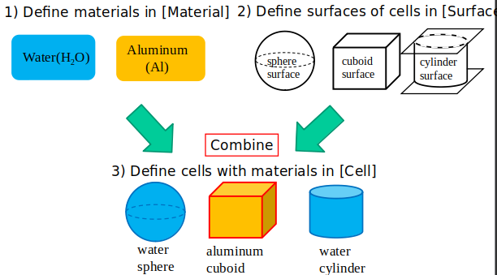
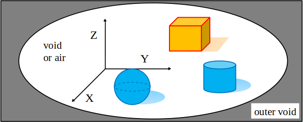
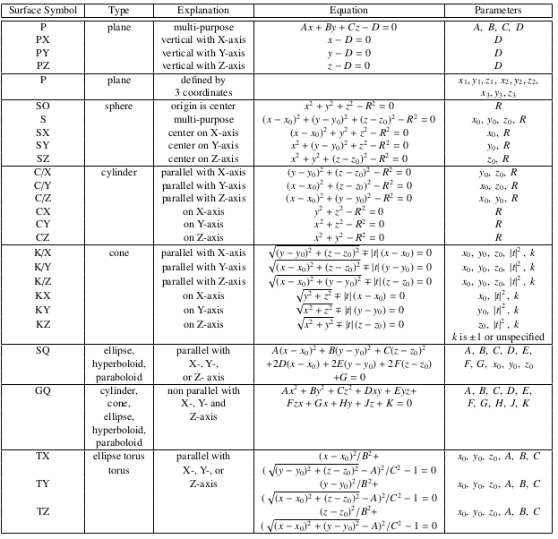
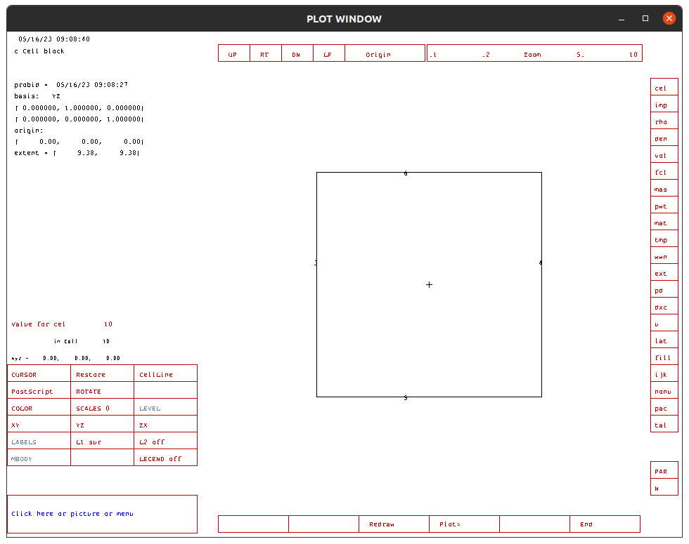
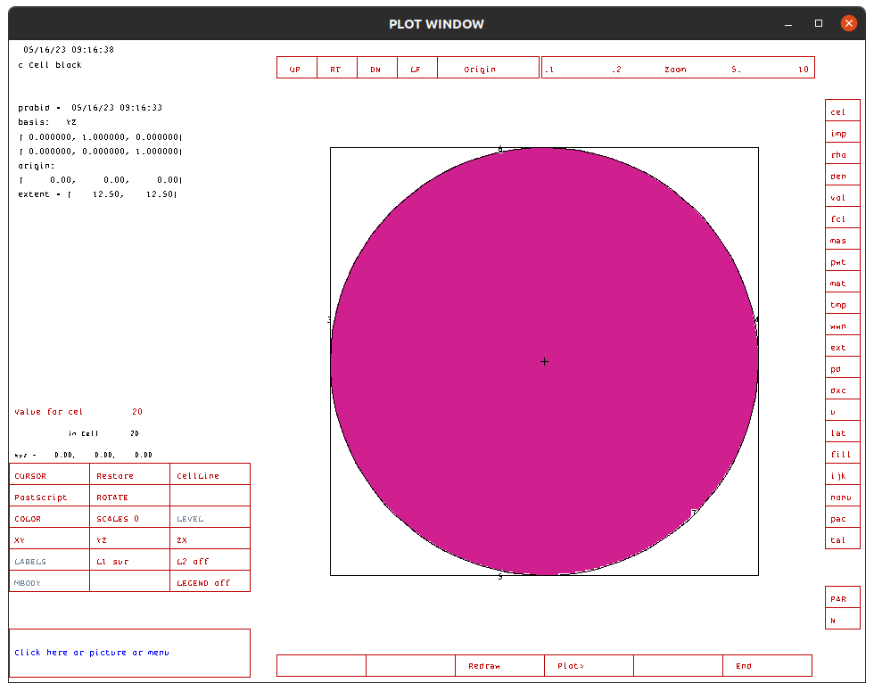
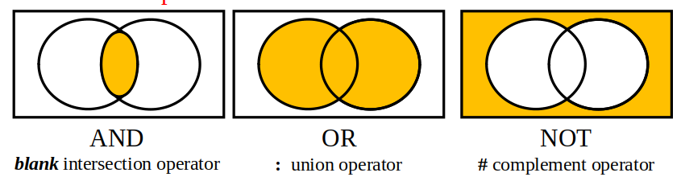
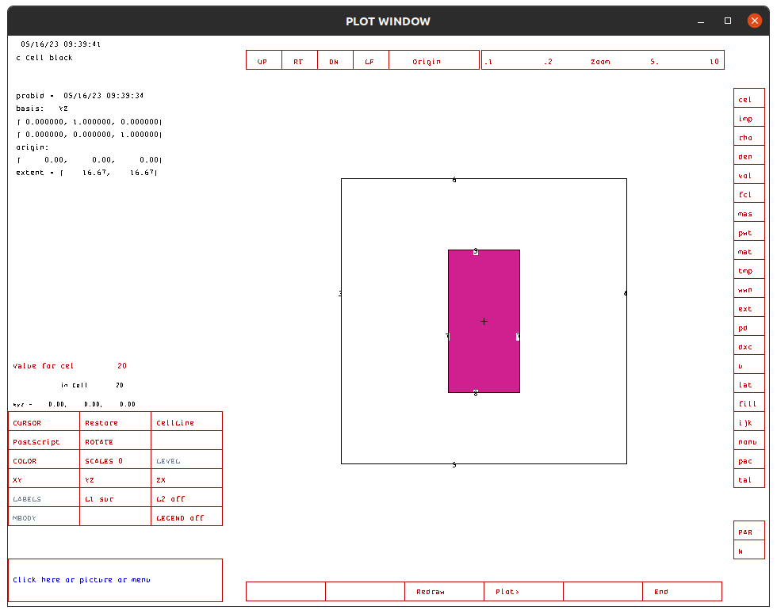
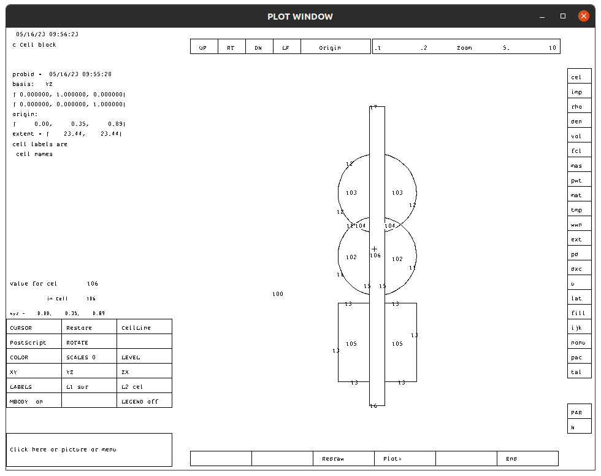

# BÀI 2. XÂY DỰNG HÌNH HỌC TRONG MCNP

## 2.1. Giới thiệu
MCNP hỗ trợ hình học kiểu CSG (Constructive Solid Geometry) tức là các hình học có thể được mô tả bởi một phương trình toán học cụ thể. Ví dụ, mặt phẳng, mặt cầu, mặt trụ, ...
Để khai báo Hình học trong MCNP, người sử dụng cần tuân thủ theo ba bước sau:
* Bước 1: Định nghĩa vật liệu, vật liệu được khai báo trong Data Block bằng cách sử dụng thẻ m (material card)
* Bước 2: Định nghĩa mặt cơ bản (surface) trong Surface Block. Các mặt là yếu tố cơ bản để tạo thành một khối rắn (kín). Ví dụ, để tạo thành một khối hình hộp, ta cần phải khai báo 6 mặt phẳng.
* Bước 3: Định nghĩ khối (cell) trong Cell Block. Các cell được tạo thành từ việc kết hợp các mặt lại với nhau bằng các toán tử AND, OR và NOT. Sau đó xác định vật liệu được lấp đầy trong cell đó từ định nghĩa vật liệu trong thẻ m. 



## 2.2. Khối World và Hệ tọa độ
* Trong mô phỏng, người ta thường phải giới hạn không gian cuar hệ vật lý bởi vì mô phỏng một không gian thực vô cùng lớn là điều không thể đáp ứng. Lý do chính bởi vì một trong những điều kiện dừng theo dõi một hạt đó là chúng đi ra ngoài bề mặt giới hạn của một không gian nhất định. Có thể  gọi đó là khối Mother World. Nói chung không có một quy tắc nào bắt buộc quy định về kiểu dáng của khối Word, tuy nhiên thông thường người ta thường khai báo khối World có dạng hình hộp chữ nhật (tạo từ 6 mặt phẳng) hoặc khối cầu (tạo từ mặt cầu) chứa bên trong là không khí hoặc chân không.

* Trong MCNP, chỉ có một hệ tọa độ toàn cầu duy nhất. Việc xác định tọa độ của các mặt, các khối sẽ phụ thuộc vào hệ toạ độ này.



## 2.3. Xây dựng hình học trong MCNP 
### 2.3.1. Định nghĩa vật liệu

* Vật liệu được khai báo thông qua thẻ m (Material cards) trong phần Data Card. Chúng được xác định bởi cú pháp như sau:

```c++
mn zaid1 frac1 zaid2 frac2 ... zaidi fraci
```
**Trong đó:**
    * m là kí hiệu thẻ vật liệu
    * n là chỉ số vật liệu (mỗi vật liệu phải có một chỉ số duy nhất)
    * zaid1, zaid2, ..., zaidi kí hiệu nguyên tố. zaid có dạng chung là ZZZAAA.nnX, với ZZZ là số hiệu nguyên tử (có tối đa 3 kí tự), AAA là số khối (yêu cầu viết đủ 3 kí tự) nn.X là bộ thư viện vật liệu. Nếu không xác định nn.X, chương trình sẽ tự động chọn.
    * frac1, frac2, ..., fraci tỉ lệ đóng góp vào vật liệu
Ví dụ 1: Định nghĩa vật liệu nước (Material id=1) theo tỉ lệ số nguyên tử trong phân tử H20.
```c++
m1 1001 0.6667 8016 0.3333
```
> **Chú ý 1:**
> * Ở đây zaid1 = 1001, zaid2 = 8016 là kí hiệu lần lượt cho nguyên tử H-1 và O-16. H chiếm 2/3 số nguyên tử trong phân tử nên sẽ có tỉ lệ là +0.6667 (viết ngắn gọn là 0.6667). Tương tự O chiếm 1/3 nên có tỷ lệ đóng góp là 0.3333
>
> * Kí hiệu ZZZAAA.nnX yêu cầu viết đầy đủ 3 kí tự đối với số khối A, và không cần viết đầy đủ ba kí tự đối với số hiệu Z nên ZZZ_H = 1; ZZZ_O = 8 và AAA_H = 001; AAA_O = 016. Thư viện vật liệu nn.X không khai báo, do đó chương trình sẽ tự động chọn.

Ví dụ 2: Định nghĩa Uran tự nhiên bao gồm 0.72% U-235 và phần còn lại là U-238.
```c++
m1 92238 -0.9928 92235 -0.0072
```
> **Chú ý 2:**
> * Dấu "-" trước tỉ lệ đóng góp được hiểu là đóng góp về phần trăm khối lượng của đồng vị trong vật liệu.
> * Để định nghĩa vật liệu có tỉ lệ đồng vị theo độ phổ cập tự nhiên ta có thể xác định chúng bởi AAA=000

Ví dụ 3: Khai báo vật liệu Uran tự nhiên có kèm theo khai báo thư viện vật liệu tương tác cho neutron

```c++
m1 92238.66c -0.9928 92235.66c -0.0072
```

> **Chú ý 3:**
> Thư viện .60c là thư viện vật liệu sử dụng trong các bài toán vận chuyển neutron.

### 2.3.2. Định nghĩa mặt
* Trong MCNP các mặt được mô tả bởi một phương trình toán học xác định, các tham số của phương trình ấy được sử dụng để xác định tham số khai báo mặt trong tệp input.
* Cú pháp chung để khai báo một mặt như sau:
```c++
j a params
```
Trong đó:
    * j là định danh ID của mặt (ID của mặt phải là duy nhất không được trùng với ID của mặt khác)
    * a kí hiệu loại mặt, chúng có thể là P, PX, PY, PZ (mặt phẳng); SO, S, SX, SY, SZ (mặt cầu); C/X, C/Y, C/Z, CX, CY, CZ (mặt trụ).
    * params là các tham số mô tả riêng cho mặt



Ví dụ 4: Định nghĩa các mặt phẳng
```c++
1 PX 10
2 PY 5
3 PZ -5
```
> **Chú ý 4:**
> * Mặt phẳng 1 là mặt phẳng song song với mặt YOZ có X = 10 cm.
> * Mặt phẳng 2 là mặt phẳng song song với mặt XOZ có Y = 5 cm
> * Mặt phẳng 3 là mặt phẳng song song với mặt XOY có Z = -5 cm

Ví dụ 5: Muốn khai báo một khối Mother World có kích thước 3 cạnh là 10 cm, 10 cm, 10 cm lần lượt theo ba trục X, Y và Z ta cần 6 mặt phẳng vuông góc với các trục. Định nghĩa 6 mặt này như sau:
```c++
10 PX -5
11 PX  5
12 PY -5
13 PY  5
14 PZ -5
15 PZ  5
```

> **Chú ý 5:**
> * Ta coi tâm của khối World trùng với gốc O của hệ tọa độ, do đó tọa độ nhỏ nhất của khối hộp sẽ là (-5; -5; -5) cm và lớn nhất sẽ là (5; 5; 5) cm để có được hình hộp kích thước 10x10x10 cm3.

**Bài tập 1: Tạo tệp mới có tên BT11 với nội dung như sau:**
```c++
c Cell block
99 0 (-1:2:-3:4:-5:6) imp:p=0
10 0 (1 -2 3 -4 5 -6) imp:p=1
c 10 0 (1 -2 3 -4 5 -6)#20 imp:p=1
c 20 1 -1.0 -7 imp:p=1 

c Surface block
1 PX -5
2 PX  5
3 PY -5
4 PY  5
5 PZ -5
6 PZ  5

c Data block
mode p
m1 1001 0.6667 8016 0.3333 $ Water

```

a) Vẽ hình bằng VisEd, kích chọn ô surface để xem ID của các mặt

Kết quả:


b) Thay đổi kích thước của khối World thành 20x20x20 cm

c) Thêm mặt cầu SO (ID = 7) có bán kính R=10cm. 
Comment lại dòng này
```c++
10 0 (1 -2 3 -4 5 -6) imp:p=1
```
Bỏ comment hai dòng sau:
```c++
c 10 0 (1 -2 3 -4 5 -6)#20 imp:p=1
c 20 1 -1.0 -7 imp:p=1 
```
Vẽ hình và xem kết quả.
Kết quả:


### 2.3.3. Định nghĩa Cell

* Quy ước về chiều của một mặt:
  * Đối với mặt phẳng chiều không gian được xác định theo hướng của trục tọa độ. Chiều âm của mặt phẳng là từ vị trí mặt phẳng tiến về âm vô cùng và chiều dương của mặt phẳng xác định từ tọa độ của mặt tiến tới dương vô cùng.

  * Đối với mặt trụ, mặt cầu: chiều dương nằm phía ngoài mặt và chiều âm nằm phía trong mặt.

* Các toán tử sử dụng để kết hợp các mặt thành một khối có biên dạng kín là AND, OR và NOT.



* Cú pháp chung của một cell như sau
```c++
j m d geo
```
Trong đó:
    * j là ID của mặt (phải là duy nhất)
    * m là ID vật liệu
    * d là khối lượng riêng (dấu - nếu có đơn vị g/cm3)
    * geom mô tả hình học của khối bằng cách kết hợp các mặt sử dụng toán tử AND, OR hoặc NOT.

Ví dụ 6: Tạo một khối cầu chứa đầy nước.
```c++
c Cell Block
10 10 -1.0 -10

c Surface Block
10 SO 10

c Data Block
m10 1001 0.6667 8016 0.3333 $ Water

```
> **Chú ý 6:**
> * Khối cầu chứa đầy nước chính là phần không gian nằm bên trong mặt cầu SO (ID=10) do đó trong cell ta thấy geo = -10
> * Vật liệu là nước do đó ta có ID=10 và mật độ là -1.0 được hiểu là 1.0 g/cm3.

Ví dụ 7: Tạo một khối trụ sắt đặc có tâm nằm trên trục OZ, bán kính 2.5 cm, chiều cao 10 cm.

```c++
c Cell block
99 0 (-1:2:-3:4:-5:6) imp:p=0
10 0 (1 -2 3 -4 5 -6) #20 imp:p=1
20 2 -7.874 (-7 8 -9) imp:p=1

c Surface block
c World surfaces
1 PX -10
2 PX  10
3 PY -10
4 PY  10
5 PZ -10
6 PZ  10
c Cylinder surfaces
7 CZ 2.5
8 PZ -5
9 PZ 5

c Data block
mode p
m2 26000 1 # Iron

```

Kết quả:


> **Chú ý 7:**
> * imp:p là khai báo độ quan trọng của Cell đối với photon, với cell bên ngoài có imp:p=0 nghĩa là vùng không gian này không được quan tâm. Điều này là bắt buộc đối với không gian bên ngoài khối World.
> * Khối trụ đặc được xây dựng từ 3 mặt gồm một mặt trụ và hai mặt phẳng. Không gian của khối trụ được nằm phía trong mặt trụ (-7) nằm bên trên mặt phẳng Z=-5 (8) và nằm dưới mặt phẳng Z=5 (-9) do đó sử dụng toán tử AND để kết hợp ba mặt phẳng này để tạo ra khối trụ.
> Khối trụ nằm bên trong khối World, và do đó phần không gian của khối World (vật liệu chân không) sẽ được coi là phần bên trong của khối hộp mà trừ (NOT) đi không gian của khối trụ (vật liệu sắt).
> * Thông thường để xác định không gian nằm bên ngoài một khối ta sẽ sử dụng toán tử OR và đảo dấu các mặt.

Ví dụ 8:
Thay cách viết 
```c++
10 0 (1 -2 3 -4 5 -6) #20 imp:p=1
```
bằng cách sử dụng toán tử AND và OR.

* Sử dụng toán tử AND thay khối 20 bằng (-7 8 -9) 
```c++
10 0 (1 -2 3 -4 5 -6) #(-7 8 -9) imp:p=1
```
* Sử dụng toán tử OR:
```c++
10 0 (1 -2 3 -4 5 -6) (7:-8:9) imp:p=1
```
### 2.3.4. Macrobody
(Tự đọc giáo trình)

**Bài tập 2: Hoàn thiện cell block cho hình học sau**



Biết:
```c++
c Cell block
 100     1 -1.0  -10  #102 #103 #104 #105 #106 imp:p=1
 101     0        10 imp:p=0
 102     1 -1.0  
 103     1 -1.0  
 104     1 -1.0  
 105     1 -1.0  
 106     1 -1.0  

c Surface block
  10  so     500.
  11  so       5.
  12  sz       8.  5.
  13  rpp     -5. 5. -5. 5. -16. -6.
  14  px       3.
  15  cz       1.
  16  pz     -19.
  17  pz      19.

c Data block
mode p
m1 1001 0.6667 8016 0.3333 $ Water
```

---
## 🚀 About Me
My name is: Bùi Tiến Hưng
I'm a researcher at [Vietnam Atomic Energy Institute](https://vinatom.gov.vn/).
Master of Science in Nuclear Engineering
- Email: hungbt1908@gmail.com          
- Phone: +84 352348985
- ResearchGate https://www.researchgate.net/profile/Bui-Tien-Hung-3

## Acknowledgements
Date created: 5/15/2023
Date edited: